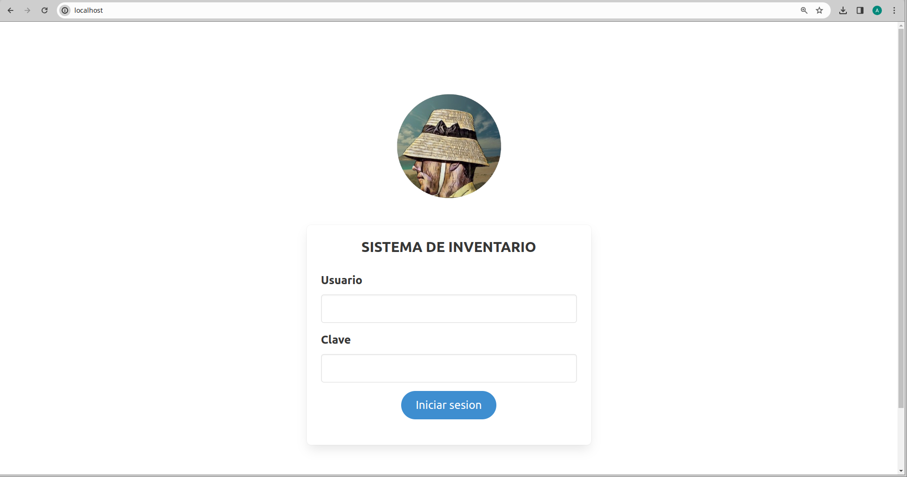

# Inventario   
Para que funcione solo tendras que clonar el respositorio y arranacar el docker compose

    git clone https://github.com/pupa14/inventarioairam.git .

''''''''''''''''''''''''''''''''''''''''''''''''''''''''''''''''''''''''''''''''''''''''''''''''''''''''''''''''''''''''''''''''''''''''''''''''''''''''''''''''''

    docker compose up -d
    
// visita localhost 
    
    
USUARIOS

Usuario por defecto: LaGraciosa
Clave: hola1234

Usuario profesor: Profe
Clave: hola1234

